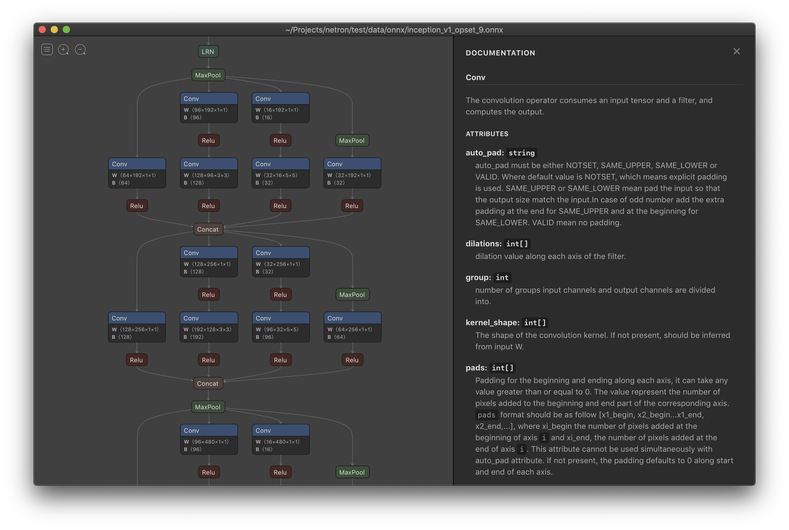

Netron is a viewer for neural network, deep learning and machine learning models. 

Netron supports **ONNX** (`.onnx`, `.pb`, `.pbtxt`), **Keras** (`.h5`, `.keras`), **Core ML** (`.mlmodel`), **Caffe** (`.caffemodel`, `.prototxt`), **Caffe2** (`predict_net.pb`), **Darknet** (`.cfg`), **MXNet** (`.model`, `-symbol.json`), **Barracuda** (`.nn`), **ncnn** (`.param`), **Tengine** (`.tmfile`), **TNN** (`.tnnproto`), **UFF** (`.uff`) and **TensorFlow Lite** (`.tflite`).

Netron has experimental support for **TorchScript** (`.pt`, `.pth`), **PyTorch** (`.pt`, `.pth`), **Torch** (`.t7`), **Arm NN** (`.armnn`), **BigDL** (`.bigdl`, `.model`), **Chainer** (`.npz`, `.h5`), **CNTK** (`.model`, `.cntk`), **Deeplearning4j** (`.zip`), **MediaPipe** (`.pbtxt`), **ML.NET** (`.zip`), **MNN** (`.mnn`), **PaddlePaddle** (`.zip`, `__model__`), **OpenVINO** (`.xml`), **scikit-learn** (`.pkl`), **TensorFlow.js** (`model.json`, `.pb`) and **TensorFlow** (`.pb`, `.meta`, `.pbtxt`, `.ckpt`, `.index`).

## Install

**macOS**: [**Download**](https://github.com/lutzroeder/netron/releases/latest) the `.dmg` file or run `brew cask install netron`

**Linux**: [**Download**](https://github.com/lutzroeder/netron/releases/latest) the `.AppImage` file or run `snap install netron`

**Windows**: [**Download**](https://github.com/lutzroeder/netron/releases/latest) the `.exe` installer or run `winget install netron`

**Browser**: [**Start**](https://www.lutzroeder.com/ai/netron) the browser version.

**Python Server**: Run `pip install netron` and `netron [FILE]` or `netron.start('[FILE]')`.

## Models

Sample model files to download or open using the browser version:

 * **ONNX**: [squeezenet](https://raw.githubusercontent.com/onnx/tutorials/master/tutorials/assets/squeezenet.onnx) [[open](https://lutzroeder.github.io/netron?url=https://raw.githubusercontent.com/onnx/tutorials/master/tutorials/assets/squeezenet.onnx)]
 * **CoreML**: [exermote](https://raw.githubusercontent.com/Lausbert/Exermote/master/ExermoteInference/ExermoteCoreML/ExermoteCoreML/Model/Exermote.mlmodel) [[open](https://lutzroeder.github.io/netron?url=https://raw.githubusercontent.com/Lausbert/Exermote/master/ExermoteInference/ExermoteCoreML/ExermoteCoreML/Model/Exermote.mlmodel)]
 * **Darknet**: [yolo](https://raw.githubusercontent.com/AlexeyAB/darknet/master/cfg/yolo.cfg) [[open](https://lutzroeder.github.io/netron?url=https://raw.githubusercontent.com/AlexeyAB/darknet/master/cfg/yolo.cfg)]
 * **Keras**: [mobilenet](https://raw.githubusercontent.com/aio-libs/aiohttp-demos/master/demos/imagetagger/tests/data/mobilenet.h5) [[open](https://lutzroeder.github.io/netron?url=https://raw.githubusercontent.com/aio-libs/aiohttp-demos/master/demos/imagetagger/tests/data/mobilenet.h5)]
 * **MXNet**: [inception_v3](https://raw.githubusercontent.com/soeaver/mxnet-model/master/cls/inception/inception_v3-symbol.json) [[open](https://lutzroeder.github.io/netron?url=https://raw.githubusercontent.com/soeaver/mxnet-model/master/cls/inception/inception_v3-symbol.json)]
 * **TensorFlow**: [chessbot](https://raw.githubusercontent.com/srom/chessbot/master/model/chessbot.pb) [[open](https://lutzroeder.github.io/netron?url=https://raw.githubusercontent.com/srom/chessbot/master/model/chessbot.pb)]
 * **TensorFlow Lite**: [hair_segmentation](https://raw.githubusercontent.com/google/mediapipe/master/mediapipe/models/hair_segmentation.tflite) [[open](https://lutzroeder.github.io/netron?url=https://raw.githubusercontent.com/google/mediapipe/master/mediapipe/models/hair_segmentation.tflite)]
 * **TorchScript**: [traced_online_pred_layer](https://raw.githubusercontent.com/ApolloAuto/apollo/master/modules/prediction/data/traced_online_pred_layer.pt) [[open](https://lutzroeder.github.io/netron?url=https://raw.githubusercontent.com/ApolloAuto/apollo/master/modules/prediction/data/traced_online_pred_layer.pt)]
 * **Caffe**: [mobilenet_v2](https://raw.githubusercontent.com/shicai/MobileNet-Caffe/master/mobilenet_v2.caffemodel) [[open](https://lutzroeder.github.io/netron?url=https://raw.githubusercontent.com/shicai/MobileNet-Caffe/master/mobilenet_v2.caffemodel)]

