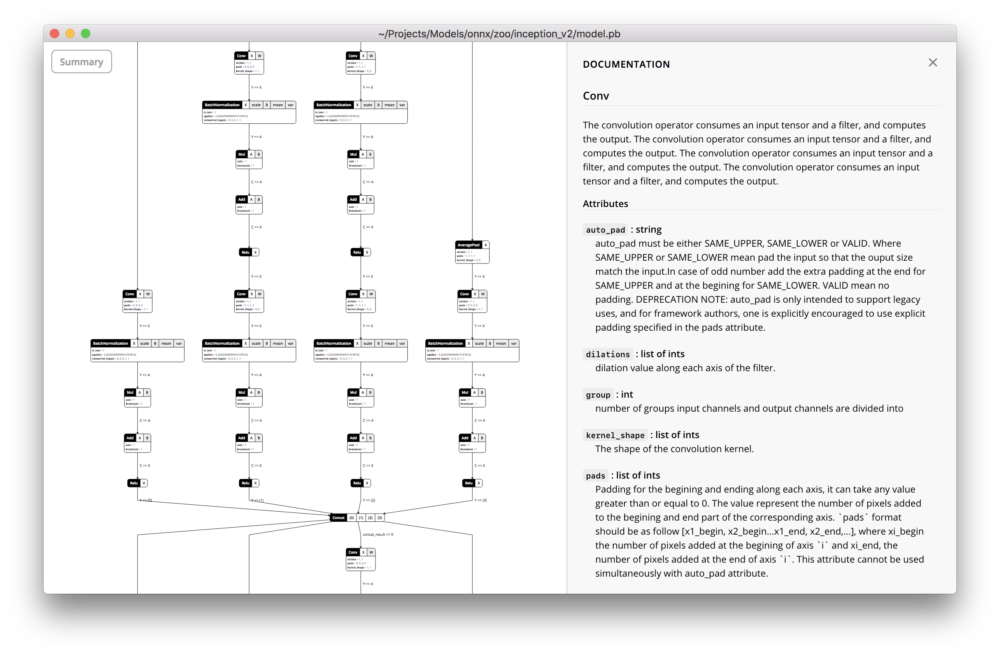

Netron is a viewer for [ONNX](http://onnx.ai) neural network models.

## Getting Started

Download and install Netron from [here](https://github.com/lutzroeder/Netron/releases).

Download example ONNX models [here](https://github.com/onnx/models).
